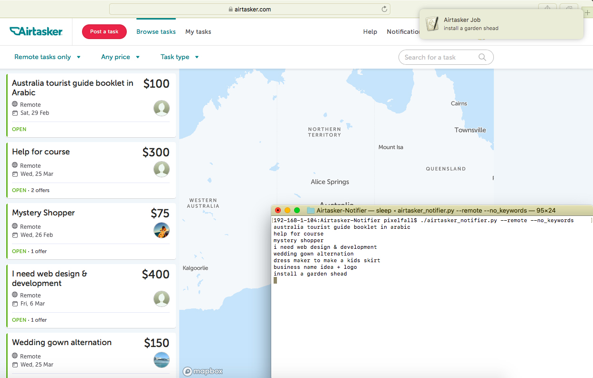

# Airtasker Notifier

how often do you spend your time constantly refreshing Airtasker, 
waiting for that data-entry job you're over qualified for, only
to discover it was posted while you were checking Facebook and
it's already been assigned. Airtasker Notifier allows you to
browse your favourite social media and be notified of jobs
with the specified keywords in their title.

# Demo

# Requirements

- A device running MacOS
- An internet connection
- Beautiful Soup module for Python 3

# Usage

>usage: ./airtasker_notifier.py --lat <latitude> --lon <longitude> <job keyword>
>

>optional arguments: --distance <maximum distance from location in km>

>                    --min <minimum pay (must be >= 5)>

>                    --max <maximum pay> (must be <= 9999)

>                    --type <'remote', 'onsite' or 'both'>

>                    --keywords <keyword 1> <keyword 2> ...

>                    --no_keywords
